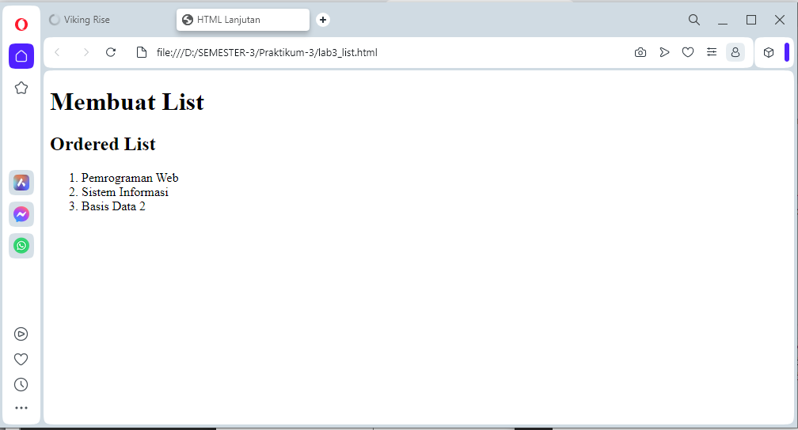
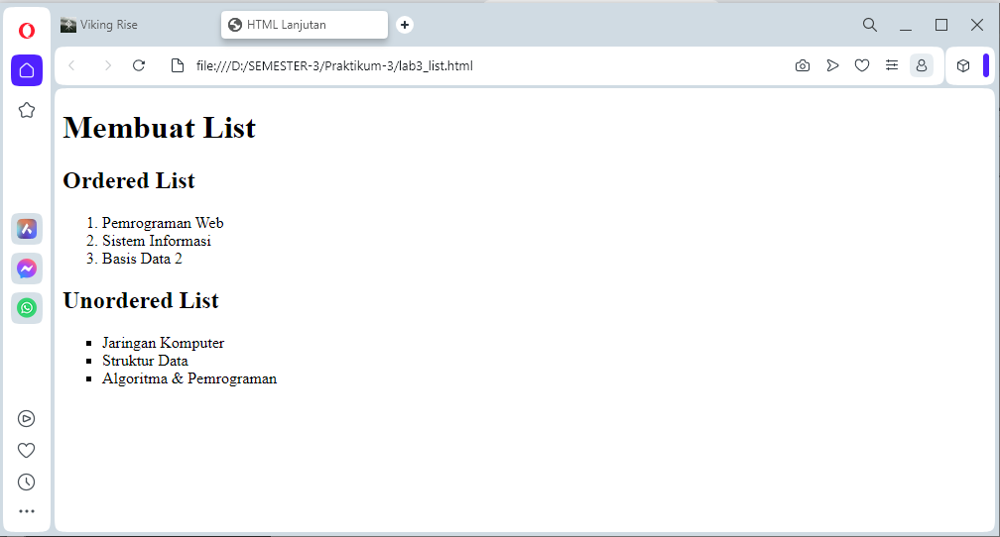
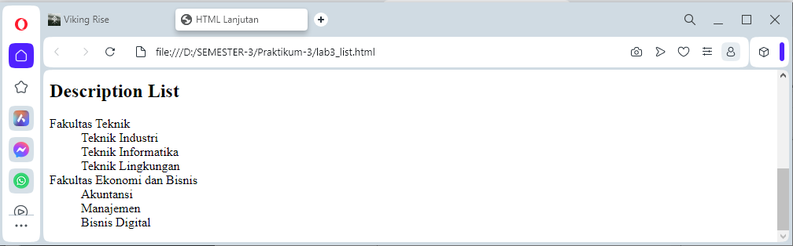
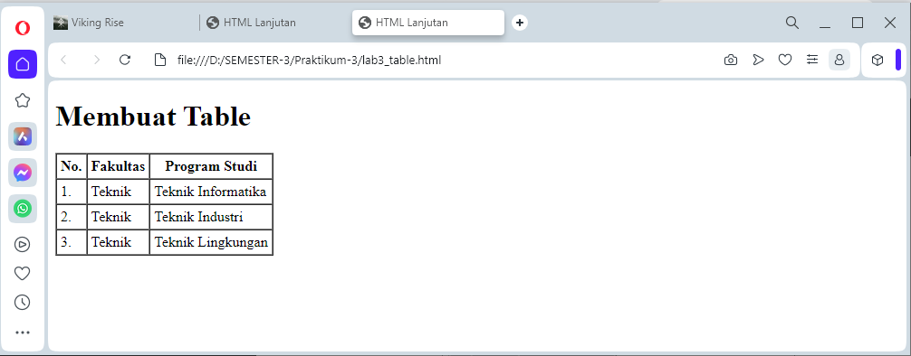
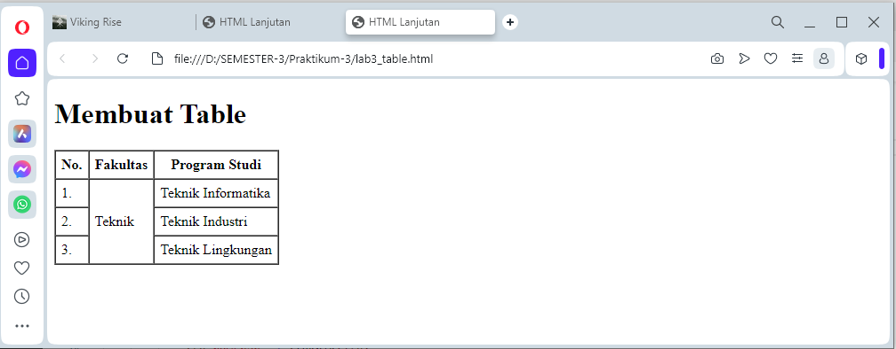
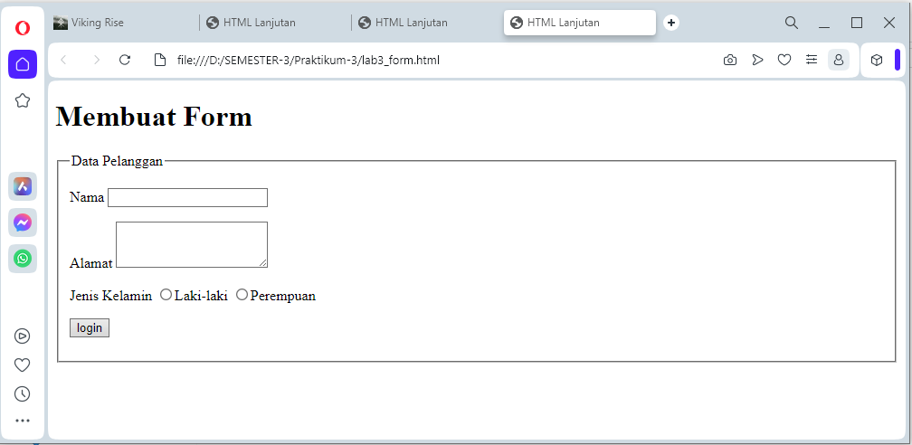
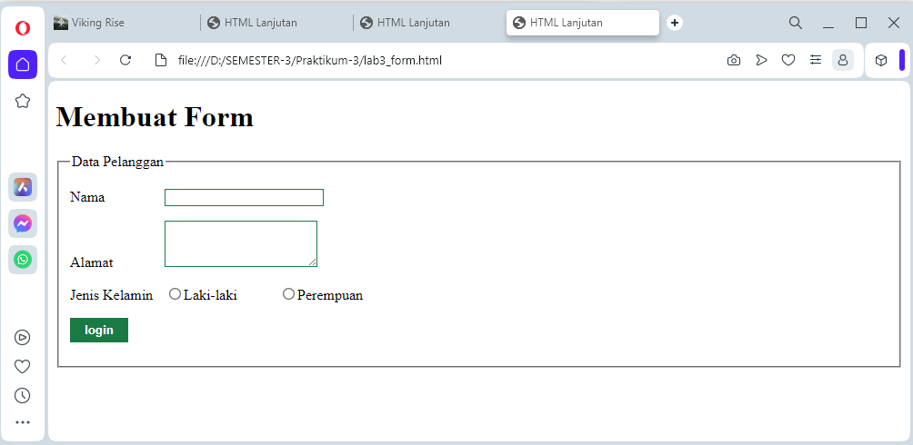
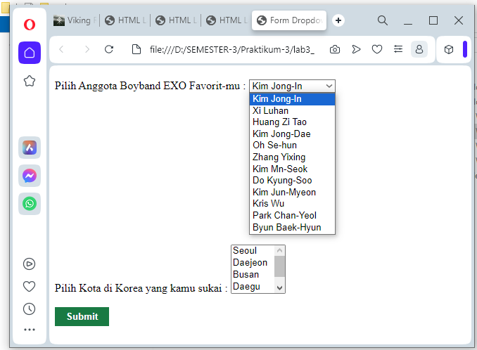

# HTML List

HTML List memungkinkan untuk mengelompokkan sekumpulan item terkait dalam sebuah daftar. HTML sudah menyediakan elemen untuk membuat list. Ada tiga macam jenis list yang bisa dibuat di HTML, yaitu:

• Ordered List adalah list yang terurut
• Unordered List adalah list yang tak terurut
• dan Descriptiona List adalah list yang berisi definisi.

## Ordered List

Digunakan untuk membuat daftar dimana tiap bagiannya ditandai dengan sebuah simbol. Ordered list dibuat dengan tag ol. Lalu di dalamnya diisi dengan item-item yang akan dimasukkan ke dalam list. Item dibuat dengan tag li (list item).

## Unordered List
Digunakan untuk membuat daftar dimana tiap bagiannya memiliki nomor secara terurut. Unordered list dibuat dengan tag ul dan untuk item-nya dibuat juga dengan tag li.

## Description List
Digunakan untuk membuat daftar dimana tiap daftar tersebut memiliki penjelasan (sub-bagian).

# PRAKTIKUM - 3

1. membuat dokumen HTML dengan nama file lab3_list.html seperti berikut.

```HTML 
<!DOCTYPE html>
<html lang="en">
<head>
    <meta charset="UTF-8">
    <meta name="viewport" content="width=device-width, initial-scale=1.0">
    <title>HTML Lanjutan</title>
</head>
<body>
    <header>
        <h1>Membuat List</h1>
    </header>
</body>
</html>
```

2. Membuat Ordered List
Kemudian tambahkan kode untuk membuat Ordered List seperti berikut.

```HTML
<section id="order-list">
    <h2>Ordered List</h2>
    <ol>
        <li>Pemrograman Web</li>
        <li>Sistem Informasi</li>
        <li>Basis Data 2</li>
    </ol>
</section>
```

- Output



3. Membuat Unorderd List
Kemudian tambakan kode untuk membuat Unordered List, setelah deklarasi ordered list pada section unordered-list, seperti berikut.

```HTML
<section id="unorder-list">
    <h2>Unordered List</h2>
    <ul type="square">
        <li>Jaringan Komputer</li>
        <li>Struktur Data</li>
        <li>Algoritma &amp; Pemrograman</li>
    </ul>
</section>
```

- Output



4. Membuat Description List
Kemudian tambahkan kode untuk membuat description list setelah deklarasi unorderd-list.

```HTML
<section id="unorder-list">
    <h2>Description List</h2>
    <dl>
        <dt>Fakultas Teknik</dt>
        <dd>Teknik Industri</dd>
        <dd>Teknik Informatika</dd>
        <dd>Teknik Lingkungan</dd>
        <dt>Fakultas Ekonomi dan Bisnis</dt>
        <dd>Akuntansi</dd>
        <dd>Manajemen</dd>
        <dd>Bisnis Digital</dd>
    </dl>
</section>
```

- Output



5. Membuat Tabel
Buat file baru dengan nama lab3_tabel.html seperti berikut.

```HTML
<!DOCTYPE html>
<html lang="en">
<head>
        <meta charset="UTF-8">
        <meta name="viewport" content="width=device-width, initial-scale=1.0">
        <title>HTML Lanjutan</title>
</head>
<body>
    <header>
        <h1>Membuat Table</h1>
    </header>

<table border="1" cellpadding="4" cellspacing="0">
    <thead>
        <tr>
            <th>No.</th>
            <th>Fakultas</th>
            <th>Program Studi</th>
        </tr>
    </thead>
    <tbody>
        <tr>
            <td>1.</td>
            <td>Teknik</td>
            <td>Teknik Informatika</td>
        </tr>
        <tr>
            <td>2.</td>
            <td>Teknik</td>
            <td>Teknik Industri</td>
        </tr>
        <tr>
            <td>3.</td>
            <td>Teknik</td>
            <td>Teknik Lingkungan</td>
        </tr>
    </tbody>
</table>
</body>
</html>
```

- Output


6. Menggabungkan Sel Data
Untuk menggabungkan sel data, gunakan atribut rowspan dan colspan. Atribut rowspan untuk menggabungkan baris (secara vertikal) dan colspan untuk menggabungkan kolom (secara horizontal).

```HTML
<table border="1" cellpadding="6" cellspacing="0">
    <thead>
        <tr>
            <th>No.</th>
            <th>Fakultas</th>
            <th>Program Studi</th>
        </tr>
    </thead>
    <tbody>
        <tr>
            <td>1.</td>
            <td rowspan="3">Teknik</td>
            <td>Teknik Informatika</td>
        </tr>
        <tr>
            <td>2.</td>
            <td>Teknik Industri</td>
        </tr>
        <tr>
            <td>3.</td>
            <td>Teknik Lingkungan</td>
        </tr>
    </tbody>
</table>
```

- Output


7. Membuat Form
Buat file baru dengan nama lab3_form.html seperti berikut.

```HTML
<!DOCTYPE html>
<html lang="en">
<head>
    <meta charset="UTF-8">
    <meta name="viewport" content="width=device-width, initial-scale=1.0">
    <title>HTML Lanjutan</title>
</head>
<body>
    <header>
        <h1>Membuat Form</h1>
    </header>
</body>
<form action="proses.php" method="post">
    <fieldset>
        <legend>Data Pelanggan</legend>
        <p>
            <label for="nama">Nama</label>
            <input type="text" id="nama" name="nama">
        </p>
        <p>
            <label for="alamat">Alamat</label>
            <textarea id="alamat" name="alamat" cols="20" rows="3"></textarea>
        </p>
        <p>
            <label>Jenis Kelamin</label>
            <input id="jk_l" type="radio" name="kelamin" value="L" /><label
    for="jk_l">Laki-laki</label>
        <input id="jk_p" type="radio" name="kelamin" value="P" /><label
    for="jk_p">Perempuan</label>
        </p>
        <p><input type="submit" value="login"></p>
    </fieldset>
</form> 
</html>
```

- Output



8. Menabahkan Style pada Form
Agar tampilan form lebih menarik, bisa ditambahkan CSS seperti berikut.

```HTML
<style>
    form p > label {
        display: inline-block;
        width: 100px;
    }
    form input[type="text"], form textarea {
        border: 1px solid #197a43;
    }
    form input[type="submit"] {
        border: 1px solid #197a43;
        background-color: #197a43;
        color: #ffffff;
        font-weight: bold;
        padding: 5px 15px;
    }
</style>
```

- Output



# Pertanyaan & Tugas

1. Buatlah form yang menampilkan dropdown menu dan listbox dengan multiple selection.

Jawab :

```HTML
<!DOCTYPE html>
<html>
<head>
    <title>Form Dropdown dan Listbox</title>
</head>
<body>
    <h2></h2>
    <form>
        <label for="dropdown">Pilih Anggota Boyband EXO Favorit-mu :</label>
        <select id="dropdown" name="dropdown">
            <option value="opsi1">Kim Jong-In</option>
            <option value="opsi2">Xi Luhan</option>
            <option value="opsi3">Huang Zi Tao</option>
            <option value="opsi4">Kim Jong-Dae</option>
            <option value="opsi5">Oh Se-hun</option>
            <option value="opsi6">Zhang Yixing</option>
            <option value="opsi7">Kim Mn-Seok</option>
            <option value="opsi8">Do Kyung-Soo</option>
            <option value="opsi9">Kim Jun-Myeon</option>
            <option value="opsi10">Kris Wu</option>
            <option value="opsi11">Park Chan-Yeol</option>
            <option value="opsi2">Byun Baek-Hyun</option>
        </select>

        <br> <br> <br> <br> <br> <br> <br> <br> <br> <br> <br> <br> <br>

        <label for="listbox">Pilih Kota di Korea yang kamu sukai :</label>
        <select id="listbox" name="listbox" multiple>
            <option value="item1">Seoul</option>
            <option value="item2">Daejeon</option>
            <option value="item3">Busan</option>
            <option value="item4">Daegu</option>
            <option value="item5">Jeju</option>
            <option value="item6">Incheon</option>
            <option value="item7">Gyeongju</option>
            <option value="item8">Ulsan</option>
            <option value="item9">Jeonju</option>
            <option value="item10">Ansan</option>
        </select>

        <br> <br>

        <input type="submit" value="Submit">
        <style>
            form input[type="submit"] {
                border: 1px solid #197a43;
                background-color: #197a43;
                color: #ffffff;
                font-weight: bold;
                padding: 5px 15px;
            }
            </style>
    </form>
</body>
</html>
```

- Output

